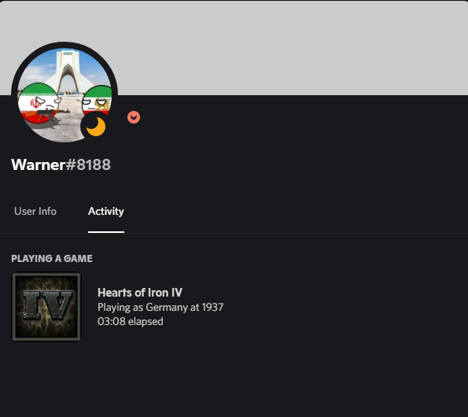

# Unofficial HoI4 Discord Rich Presence Integration
#
#
> This program tries to find your game information by finding the saved game files (autosave.hoi4) in the documents. Including the selected country and date of your game.

### Installation
* Open `setup.exe` file
* Wait for `setup.exe` to popup "Setting Applied !"
* Open Hearts of Iron IV and play and play for a in-game month
* Now open `Hoi4 Discord Rich Presence Beta.exe` 
* Done! next time you just have to run `Hoi4` and `Hoi4 Discord Rich Presence Beta.exe`

### Bugs
> I know, it's not always going to work,
> so i made a discord support server for it.
> you can join and explain whats wrong so i'll help you !

### Why should I trust your .exe file?
> You can scan it by anti-virus websites or apps to make sure it's not a malware or something.

### What `setup.exe` does ?
> This file is supposed to change your game settings so that from now on it will not save the saved game files in binary.

### How do I close this ?
> Close Hearts of Iron IV
